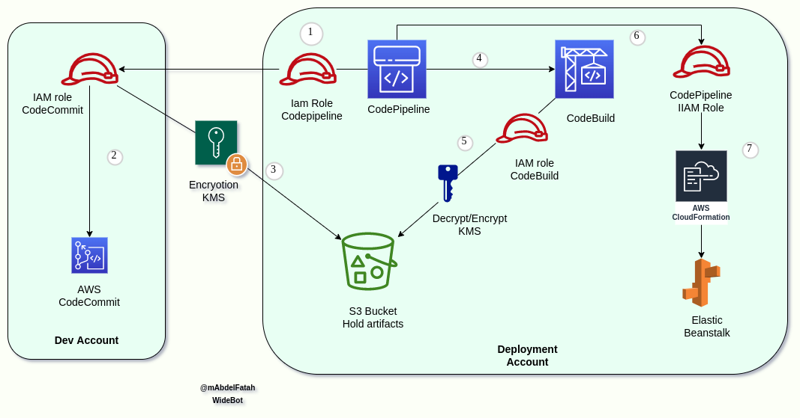

# Reference Architecture: Cross Account Continous Delivery CodePipeline

This reference architecture demonstrates how to push code hosted in [AWS CodeCommit](https://aws.amazon.com/codecommit/) repository in Development Account,
use [AWS CodeBuild](https://aws.amazon.com/codebuild/) to do application build, store the output artifacts in S3Bucket, validate your deployment then approve the changes to be deployed to the Production or deployment Account using [AWS CloudFormation](https://aws.amazon.com/cloudformation/). This orchestration of code movement from code checkin to deployment is securely handled by [AWS CodePipeline](https://aws.amazon.com/codepipeline/).



## Running the example
> You need to create the CodeCommit repository (steps below) before making the pipeline infrastructure. 
> When creating the pipeline infrastructure, you can use the `singleClick_CD_pipeline.sh` script or else follow the "Walkthrough" section of the attached `Deployment_Guide.pdf` 


#### Pre-requisites 
1. Install the [AWS CLI](https://docs.aws.amazon.com/cli/latest/userguide/cli-chap-install.html).
3. Clone this repository.
4. Have the following AWS accounts (if using Control Tower, [this is useful](https://docs.aws.amazon.com/controltower/latest/userguide/account-factory.html#quick-account-provisioning)):
    * Deployment
    * Development

#### 1. Create a sample application using Serverless Application Model (SAM). 

We will create use sample application locally, then commit the code to CodeCommit in Development account. From there, CodePipeline will build the application code, store the output artifacts in S3Bucket, validate your deployment then approve the changes to be deployed to the Production or deployment Account, deployment should be using CloudFormation as the infrastructure as a code.  If you accept the review in CodePipeline, the application will be deployed to production using CloudFormation. 

##### Create the sample application locally


Navigate to the project folder and initialize the git client
```console
cd sample-application/
git init
```

#### 2. Create [AWS CodeCommit](code-commit-url) repository in Development Account
##### Console Method
Follow the [instructions here](http://docs.aws.amazon.com/codecommit/latest/userguide/getting-started.html#getting-started-create-repo) to create a CodeCommit repository in the Development Account. Name your repository as sample-application.

##### Terminal Method
From your terminal application, execute the following command. You may refer [here](http://docs.aws.amazon.com/codecommit/latest/userguide/how-to-create-repository.html#how-to-create-repository-cli) for further details on installing the AWS CLI if needed.

```console
aws codecommit create-repository --repository-name sample-application --repository-description "Sample Serverless App" --profile {{DEV-ACCOUNT-PROFILE}}
```

Note the cloneUrlHttp URL in the response from above CLI.

#### 3. Add a new remote

From your terminal application, execute the following command:

```console
git remote add AWSCodeCommit {{HTTP_CLONE_URL_FROM_STEP_2}}
```

Follow the instructions [here](http://docs.aws.amazon.com/codecommit/latest/userguide/setting-up.html) for local git setup required to push code to CodeCommit repository.

> Tip: The AWS CodeCommit Helper is useful to obtain Codecommit credentials using a profile, for example: 
>```console
>git config --global credential.helper '!aws --profile {{YOUR-PROFILE-HERE}} codecommit credential-helper $@'
>```

#### 4. Push the code AWS CodeCommit

From your terminal application, execute the following command:

```console
git add .
git commit -m "First push of my sample app!"
git push AWSCodeCommit master
```

#### 5. See the pipeline in action.
Once you have your pipeline configured as per the `singleClick_CD_pipeline.sh` or the attached `Deployment_Guide.pdf` file across your Deployment and development AWS accounts, codepipeline will listen for new deployments to your 'sample-application' repository, so Once it's spun up, push a change to the CodeCommit repo you just made then log in to your Deployment AWS account to ensure your codepipeline execution has kicked off. 

